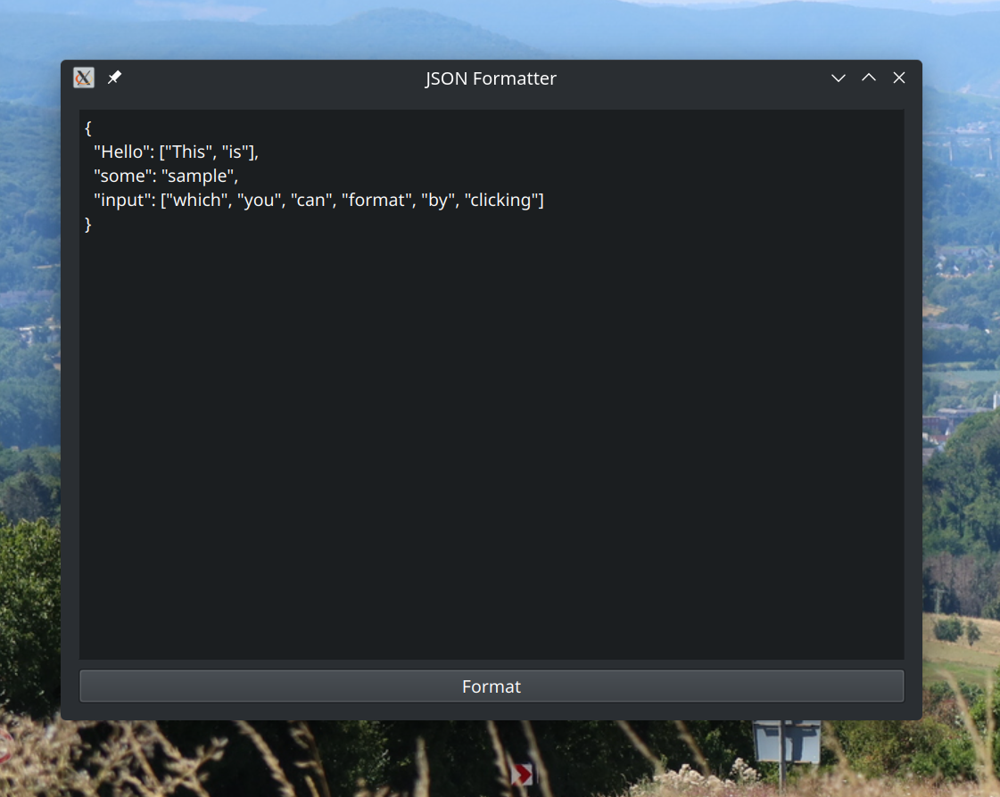

# Qt GUI for JSON formatting with compact-json

I work with a bunch of JSON artifacts. And with most formatting libraries there are only two options: Either have it very compact and not suitable for humans, or so verbose that it takes up a lot of vertical space.

Take the following input:

```json
{"Hello": ["This", "is"], "some": "sample", "input": ["which", "you", "can", "format", "by", "clicking"]}
```

Many JSON formatters format it verbosely like this:

```json
{
  "Hello": [
    "This",
    "is"
  ],
  "some": "sample",
  "input": [
    "which",
    "you",
    "can",
    "format",
    "by",
    "clicking"
  ]
}
```

But what I really want it some middle ground, and the [`compact-json` library](https://github.com/masaccio/compact-json) provides exactly this. Depending on the chosen options you get this output:

```json
{
  "Hello": ["This", "is"], 
  "some": "sample", 
  "input": ["which", "you", "can", "format", "by", "clicking"]
}
```

This project here provides an overly simple Qt 6 GUI around that library and looks like this:



# Installation

You can just install it from PyPI:

```
pip install compact-json-qt-gui
```

And then start it with `compact-json-qt-gui`.